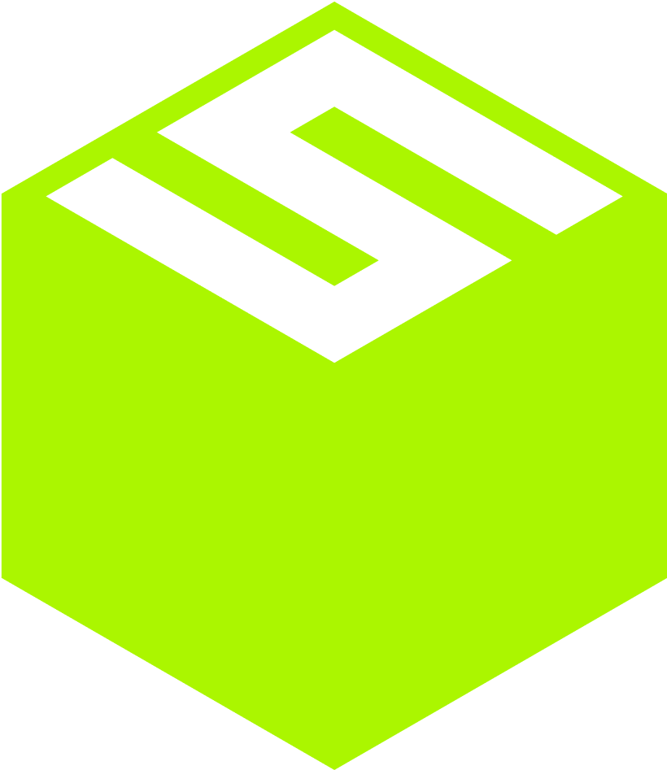

<!-- PROJECT SHIELDS -->
[![Contributors][contributors-shield]][contributors-url]
[![Forks][forks-shield]][forks-url]
[![Stargazers][stars-shield]][stars-url]
[![Issues][issues-shield]][issues-url]
[![MIT License][license-shield]][license-url]


<!-- PROJECT LOGO -->
<br />
<div align="center">
  <a href="https://sightai.io/">
    
  </a>

<h3 align="center">SightAI Services</h3>

  <p align="center">
    Handling onchain-offchain communication between Users and AI Gateways.
    <br />
  </p>
</div>


<!-- ABOUT THE PROJECT -->
## About The Project

![Product Name Screen Shot][product-screenshot]

Sight Services wraps two key services, bridging the gap between Users and AI Gateways among onchain and offchain datas and communication:
- **Puller**. Keep monitoring Subgraph, sync onchain activities to offchain environment. 
- **Restful API server**. Handle offchain interactions between Users and AI Gateways.


<!-- GETTING STARTED -->
## Getting Started

To get a local copy up and running follow these simple example steps.

### Prerequisites

This is an example of how to list things you need to use the software and how to install them.
* sight chain & rpc 
  - For Sight Chain, get a rpc endpoint from [us](https://t.me/sightai) i.e. "http://35.189.150.78:8545/".
  - For local environment, we suggest to use [hardhat](https://hardhat.org/hardhat-network/docs/overview) to setup a localhost.
    - ```sh
      npx hardhat node
      ``` 
    - The localhost node rpc will be available at http://localhost:8545   

* subgraph
  - For Sight Chain hosted subgraph, get a graphql endpoint i.e. "http://34.146.79.47:8000/subgraphs/name/vault".  
  - For local environment, check how to deploy your subgraph [here](https://github.com/graphprotocol/example-subgraph).

* golang - recommend to use version go1.21.x 
  ```sh
  go version
  ```

* openapi-generator
  ```sh
  brew install openapi-generator
  ```

### Installation
1. Clone the repo
   ```sh
   git clone https://github.com/xxx/xxx.git
   ```
2. Install Go modules
   ```sh
   go get -u ./...
   ```
3. Update your configurations in `build/config.yml`
   ```yml
   jwtSecret: "YOUR JWT SECRET"
   privateKey: "YOUR PRIVATE KEY"
   mysql: "YOUR MYSQL SETUP"
   subgraph: "YOUR SUBGRAPH SETUP"
   ```
4. Creat your database with initial data
   - Config initial data in tools/insert_static_data/data/csv/...
   - Run following commands to setup database 
      ```sh
      make init_db
      ```

<!-- USAGE EXAMPLES -->
## Usage
- Puller
  - To run locally
    ```sh
    make run_puller
    ```
  - To make docker
    ```sh
    make puller_docker
    ```
- Restful Service
  - To run locally
    ```sh
    make run_rest
    ```
  - To make docker
    ```sh
    make rest_docker
    ```
  - By default, restful api service listens to http://localhost:10101
  - Please follow [swagger api doc](https://app.swaggerhub.com/apis/GaliL/sightai-services/1.0.0) for detailed usage.

<!-- ROADMAP -->
## Roadmap

- [x] MVP version for single gateway
- [x] Support user/gateway onchain withdraw after signal
- [ ] Support multiple gateways

<!-- CONTRIBUTING -->
## Contributing

Contributions are what make the open source community such an amazing place to learn, inspire, and create. Any contributions you make are **greatly appreciated**.

If you have a suggestion that would make this better, please fork the repo and create a pull request. You can also simply open an issue with the tag "enhancement".
Don't forget to give the project a star! Thanks again!

1. Fork the Project
2. Create your Feature Branch (`git checkout -b feature/AmazingFeature`)
3. Commit your Changes (`git commit -m 'Add some AmazingFeature'`)
4. Push to the Branch (`git push origin feature/AmazingFeature`)
5. Open a Pull Request


<!-- LICENSE -->
## License

Distributed under the MIT License. See `LICENSE.txt` for more information.


<!-- CONTACT -->
## Contact

Sight AI - [@theSightAI](https://x.com/thesightai) - [TG Community](https://t.me/sightai)

Project Link: [https://github.com/xxx](https://github.com/xxx)

<!-- MARKDOWN LINKS & IMAGES -->
<!-- https://www.markdownguide.org/basic-syntax/#reference-style-links -->
[contributors-shield]: https://img.shields.io/github/contributors/othneildrew/Best-README-Template.svg?style=for-the-badge
[contributors-url]: https://github.com/OAI/OpenAPI-Specification/graphs/contributors
[forks-shield]: https://img.shields.io/github/forks/othneildrew/Best-README-Template.svg?style=for-the-badge
[forks-url]: https://github.com/OAI/OpenAPI-Specification/network/members
[stars-shield]: https://img.shields.io/github/stars/othneildrew/Best-README-Template.svg?style=for-the-badge
[stars-url]: https://github.com/OAI/OpenAPI-Specification/stargazers
[issues-shield]: https://img.shields.io/github/issues/othneildrew/Best-README-Template.svg?style=for-the-badge
[issues-url]: https://github.com/OAI/OpenAPI-Specification/issues
[license-shield]: https://img.shields.io/github/license/othneildrew/Best-README-Template.svg?style=for-the-badge
[license-url]: LICENSE.txt
[product-screenshot]: images/sight_screenshot.png